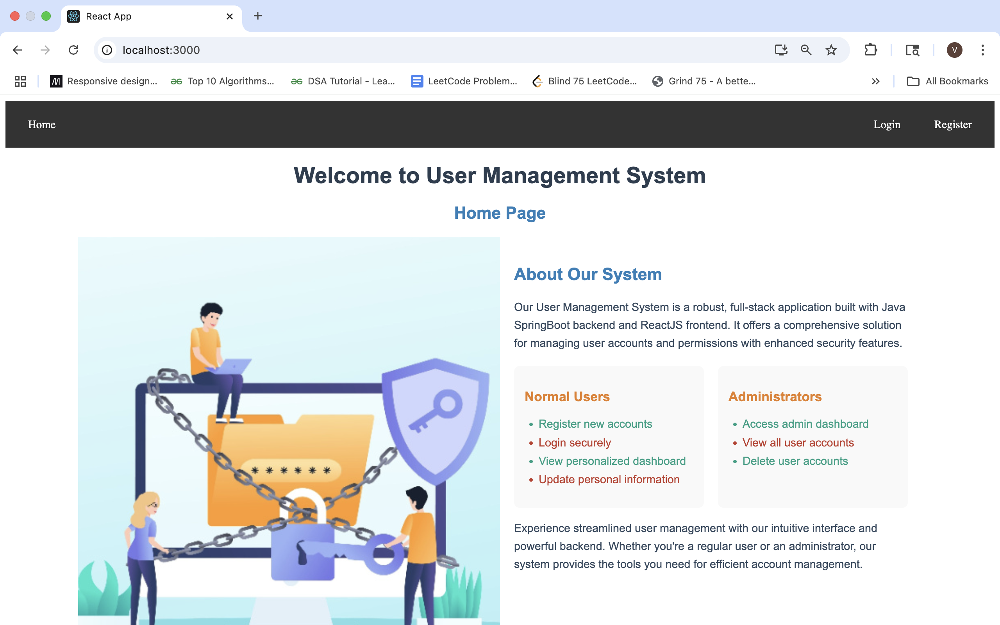
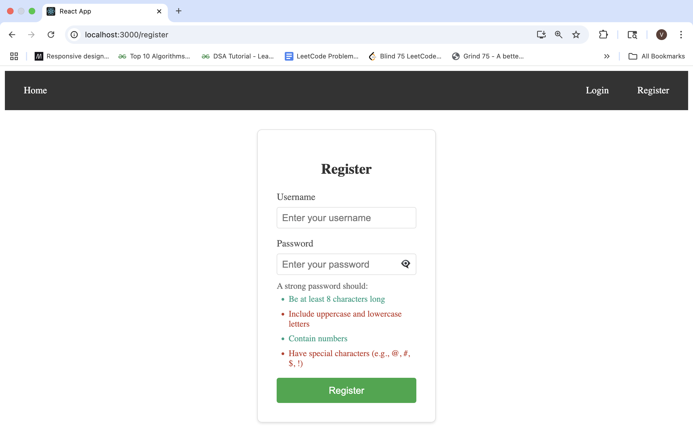
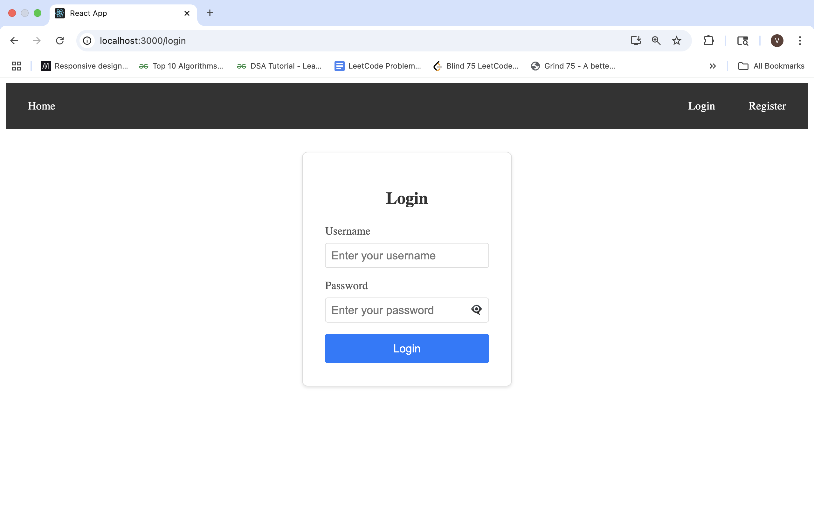
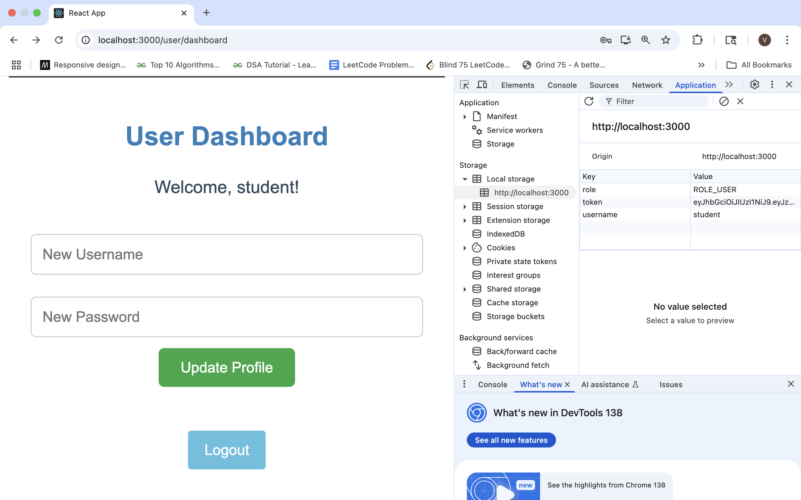
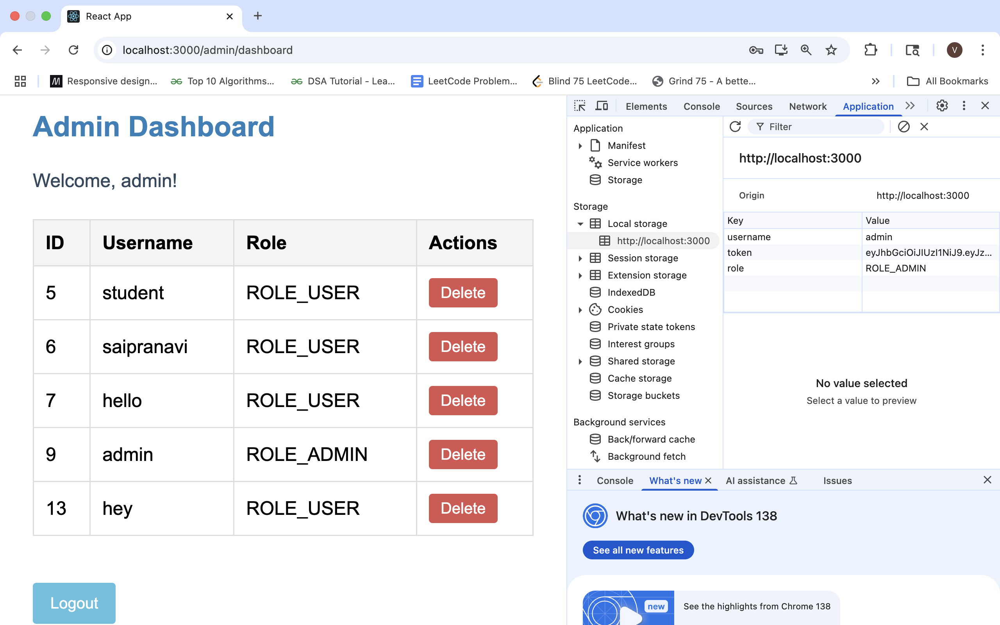

# 🛡️ Full Stack User Management System with Enhanced Security

This project is a full-stack web application designed to securely manage user data. It features authentication, role-based access control, and secure API communication using **Spring Security** and **JWT**. Users are divided into **Normal Users** and **Admins**, each with distinct functionality.

> ⚠️ **Project Structure**
> - `main` branch: Contains the **React.js frontend**
> - `master` branch: Contains the **Spring Boot backend**
>
> Please switch branches accordingly to explore the full project.

---

## 🧩 Tech Stack

### 🌐 Frontend (React.js) – `main` branch
- **ReactJS**: Build dynamic UI components
- **React Router**: Navigation and route protection
- **Axios**: API communication with backend
- **Bootstrap**: Responsive and modern UI design

### 🖥️ Backend (Spring Boot) – `master` branch
- **Spring Boot**: RESTful API and core business logic
- **Spring Security + JWT**: Authentication and authorization
- **MySQL**: Persistent user data storage

---

## 🔐 Key Features

### ✅ Authentication
- Secure login and registration
- JWT-based authentication
- Token stored in `localStorage` for protected requests

### 🧑‍💼 Role-Based Access
- **Normal Users**:
  - Access personal dashboard
  - View and update their own data
- **Admins**:
  - Access admin dashboard
  - View and delete users
  - Full CRUD operations on employee/user data

### 🔒 Secure Frontend Routing
- Protected routes using React Router
- Conditional rendering based on authentication and roles
- Redirection to login for unauthorized access attempts

---

## 🚀 How to Run the Application

### 📦 Backend Setup (from `master` branch)
1. Checkout the `master` branch:
   ```bash
   git checkout master

2. Configure MySQL and update the application.properties file with your DB details.

3. Run the backend using Maven:
    ```bash
    ./mvnw spring-boot:run

🎨 Frontend Setup (from main branch)
1. Stay on the main branch (default).
2. Navigate to the project root (or frontend folder if created).
3. Install dependencies and run the frontend:
    ```bash
    npm install
    npm start

📁 Project Structure

main (React Frontend)
├── public/
├── src/
├── package.json
└── ...

master (Spring Boot Backend)
├── src/
├── pom.xml
├── application.properties
└── ...







For backend details and API documentation, see the [master branch README](https://github.com/Pranavi2002/Full-Stack-Security-Project/blob/master/README.md).

---

## 👩‍💻 Author
### Pranavi Kolipaka
Feel free to connect: [LinkedIn] (https://www.linkedin.com/in/vns-sai-pranavi-kolipaka-489601208/) | [GitHub] (https://github.com/Pranavi2002)